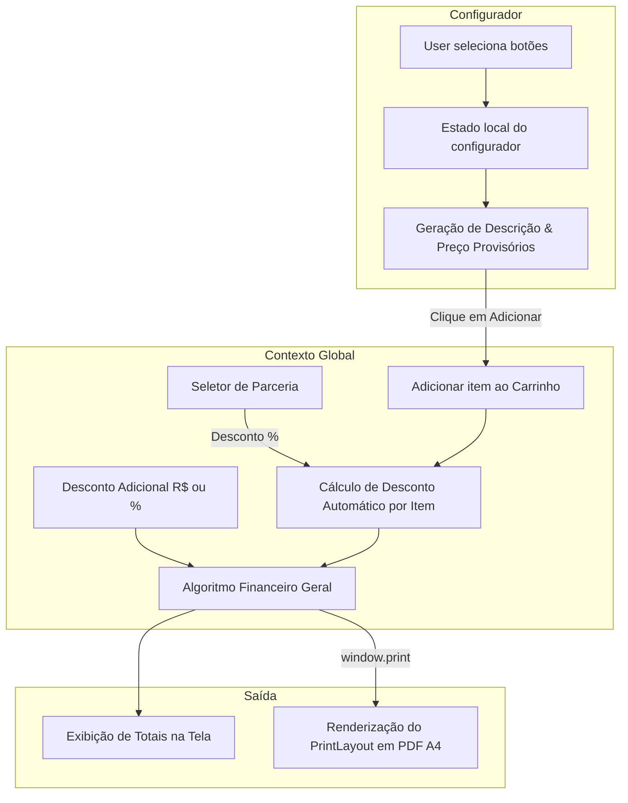

# Especificação Técnica Completa (SPEC): Sistema de Orçamentos Fase Esporte

Este documento descreve a especificação técnica detalhada, as regras de negócios, os algoritmos de cálculo de preços, as estruturas de estados e as especificações de interface para o **Gerador de Orçamentos da Fase Esporte**. 

Este documento servirá como a **única fonte da verdade** para a implementação da aplicação React e o seu alinhamento com o Design System.

---

## 1. Visão Geral do Escopo

A **Fase Esporte** (Teixeira de Freitas - BA) necessita de uma aplicação web de página única (SPA) responsiva e interativa que simplifique a elaboração de orçamentos formais por parte dos vendedores. 

Atualmente, o processo é manual e suscetível a erros de digitação e cálculo ao consultar tabelas Excel complexas. O novo sistema automatizará o cálculo de preços unitários e totais e a geração da descrição técnica da peça, oferecendo um layout profissional otimizado para impressão em A4 (salvar em PDF e enviar no WhatsApp).

---

## 2. Tecnologias Utilizadas e Arquitetura de Estruturas

O sistema é projetado para operar com o máximo de eficiência, velocidade e robustez, utilizando uma stack estática moderna que elimina a necessidade de bancos de dados remotos ou conexões com servidores adicionais.

### 2.1. Stack de Tecnologias

1. **React 18+ (SPA)**: Biblioteca declarativa para gerenciamento dinâmico da interface do usuário e estado local/global, garantindo renderizações reativas ultra-rápidas em menos de 5ms.
2. **Vite**: Bundler e servidor de desenvolvimento ultra-rápido que compila o projeto em arquivos estáticos otimizados para produção.
3. **Vanilla CSS (Moderno)**: Uso de folhas de estilo customizadas com variáveis nativas CSS para os tokens de design, flexbox, grid layouts, glassmorphism e animações fluidas. A escolha do Vanilla CSS garante controle absoluto sobre a estilização e impede incompatibilidades em navegadores legados.
4. **React Context API**: Gerenciamento de estado global da aplicação para unificar o carrinho, informações de clientes e a lógica financeira sem a necessidade de bibliotecas externas complexas (Redux/Zustand).
5. **Lucide React**: Biblioteca de ícones vetoriais modernos, limpos e responsivos.
6. **HTML5 Canvas / CSS Print**: Estrutura de visualização econômica A4 baseada em CSS Print Media para renderização nativa de PDF de altíssima fidelidade.

---

### 2.2. Estrutura do Diretório do Projeto

A organização das pastas separa as responsabilidades entre dados estruturados, componentes visuais puros e o gerenciamento de estado global comercial:

```text
orcamentofase/
├── public/                   # Arquivos públicos estáticos
│   └── favicon.ico           # Favicon do app
├── src/
│   ├── assets/               # Ativos visuais do projeto
│   │   ├── logo-branco.svg   # Vetor oficial da marca para telas escurecidas
│   │   └── logo-preto.svg    # Vetor oficial para telas claras e impressão A4
│   ├── data/                 # Banco de dados estático
│   │   └── prices.js         # Dados de preços convertidos do Excel (JSON nativo)
│   ├── context/              # Gerenciador comercial (Lógica e Estado)
│   │   └── BudgetContext.jsx # Provedor que unifica carrinho, parcerias e cálculos
│   ├── components/           # Componentes modulares reutilizáveis
│   │   ├── ProductSelectors/ # Configuradores de botões por categoria
│   │   │   ├── KitEsportivoSelector.jsx
│   │   │   ├── CamisaMalhaSelector.jsx
│   │   │   ├── EstampaTotalSelector.jsx
│   │   │   ├── CamisaPPSelector.jsx
│   │   │   ├── SocialSelector.jsx
│   │   │   ├── TactelHelancaSelector.jsx
│   │   │   ├── BandeiraSelector.jsx
│   │   │   └── AbadaSelector.jsx
│   │   ├── BudgetCart.jsx    # Tabela dinâmica de itens do orçamento
│   │   ├── ClientForm.jsx    # Inputs do cliente, descontos e prazos
│   │   └── PrintLayout.jsx   # Layout oculto A4 que surge na impressão PDF
│   ├── App.jsx               # Estrutura principal de montagem (Grid de 2 colunas)
│   ├── index.css             # Tokens do Design System & Estilos globais
│   └── main.jsx              # Inicialização do React
├── package.json              # Dependências e scripts do projeto
├── README.md                 # Manual de desenvolvimento e execução
└── SPEC.md                   # Esta especificação técnica
```

---

### 2.3. Diagrama do Fluxo de Estado Comercial



---

### 2.4. Estrutura de Componentes, Props e Estados locais

Para garantir uma implementação limpa e sustentável, definimos os papéis de cada componente, suas propriedades de entrada (Props) e as estruturas de estado local (State) que eles mantêm:

| Componente | Papel Principal | Props Recebidas | Estados Locais (useState) |
| :--- | :--- | :--- | :--- |
| **App** | Inicializar layout global de 2 colunas e alternar as abas (tabs) da esquerda. | Nenhuma | `activeTab` (string indicando a aba selecionada). |
| **KitEsportivoSelector** | Configuração de uniformes e peças da linha de treino de futebol. | Nenhuma | - `selectedKit` (string)<br>- `extras` (array de strings)<br>- `quantity` (number)<br>- `addedMaterials` (array). |
| **CamisaMalhaSelector** | Configuração de camisas de malha com brackets regressivos. | Nenhuma | - `golaType` (string)<br>- `fabric` (string)<br>- `quantity` (number)<br>- `selectedExtras` (array de strings). |
| **EstampaTotalSelector**| Configuração de camisas de estampa por sublimação 100% total. | Nenhuma | - `golaType` (string)<br>- `fabric` (string)<br>- `area` (string)<br>- `quantity` (number)<br>- `selectedExtras` (array). |
| **CamisaPPSelector** | Configuração de camisas promocionais prontas (PP branca/cores). | Nenhuma | - `color` (string)<br>- `config` (string)<br>- `area` (string)<br>- `quantity` (number)<br>- `usePhoto` (string). |
| **SocialSelector** | Escolha de uniformes sociais e industriais em Brim ou tecidos nobres. | Nenhuma | - `activeCategory` (string)<br>- `selectedItem` (object)<br>- `fabricSocial` (string/Ibiza ou Unioffice)<br>- `quantity` (number). |
| **TactelHelancaSelector**| Seleção de calças, jaquetas e shorts de tactel e helanca infantil/adulto. | Nenhuma | - `fabric` (tactel/helanca)<br>- `selectedItem` (object)<br>- `ageGroup` (adulto/infantil)<br>- `isStamped` (boolean)<br>- `quantity` (number). |
| **BandeiraSelector** | Configuração de metragens e acessórios de bandeiras sublimadas. | Nenhuma | - `type` (simples/dupla face)<br>- `sizeDesc` (string)<br>- `extras` (array de strings)<br>- `quantity` (number). |
| **AbadaSelector** | Configuração de abadás promocionais de carnaval e micaretas. | Nenhuma | - `fabric` (string)<br>- `quantity` (number)<br>- `withBandana` (boolean). |
| **BudgetCart** | Listar os itens inseridos, permitindo excluir ou alterar volumes rapidamente. | Nenhuma | Nenhum (Lê e edita dados via `BudgetContext`). |
| **ClientForm** | Coleta de dados cadastrais, descontos manuais, prazos e parcerias da Fase Esporte. | Nenhuma | Nenhum (Gerenciado globalmente via `BudgetContext`). |
| **PrintLayout** | Otimização do layout A4 formal, carregando a logo preta e condições para impressão. | Nenhuma | Nenhum (Puxa totais e itens do Contexto global). |

---

### 2.5. Estrutura do Estado Global (BudgetContext)

O `BudgetContext` funciona como o cérebro comercial da aplicação, expondo propriedades e métodos acessíveis por todos os componentes por meio do hook personalizado `useBudget()`.

```javascript
// Exemplo da estrutura de estado compartilhada pelo Context
{
  cart: [
    {
      id: "timestamp-hash",
      category: "camisa_malha",
      description: "CAMISA MALHA - Gola Polo Simples - Tecido PV - Manga Longa",
      quantity: 120,
      unitPrice: 50.45,
      totalPrice: 6054.00,
      originalUnitPrice: 50.45, // Sem desconto de parceria
      partnerDiscountPercent: 15, // Desconto aplicado a este item
      finalUnitPrice: 42.88      // Preço com desconto de parceria aplicado
    }
  ],
  clientData: {
    name: "",
    phone: "",
    partnership: "Nenhuma" // Seleção de escolinha, academia, etc.
  },
  conditions: {
    paymentTerms: "entrada de 50% no ato do pedido e o restante na entrega do mesmo...",
    deliveryDays: 30,
    validityDays: 7
  },
  additionalDiscount: {
    type: "percentage", // "percentage" | "fixed"
    value: 0
  },
  
  // Métodos expostos para manipulação de ações
  addItemToBudget: (item) => void,
  removeItemFromBudget: (id) => void,
  updateItemQuantity: (id, qty) => void,
  updateClientData: (field, val) => void,
  updateConditions: (field, val) => void,
  updateAdditionalDiscount: (type, val) => void,
  clearBudget: () => void,
  
  // Totais calculados em tempo real
  subtotalBruto: 0,
  totalParceriaDesconto: 0,
  totalLíquido: 0,
  entradaSugerida: 0
}
```

---

## 3. Estrutura da Interface do Usuário (UI)

A tela principal será dividida em um **layout responsivo de duas colunas (Desktop)**:

### 3.1. Coluna Esquerda: Configurador de Produtos (60% da largura)
- **Painel Superior de Abas (Tabs)**: Botões horizontais ou menu lateral com ícones para alternar entre as 8 categorias de produtos:
  - ⚽ *Kit Esportivo*
  - 👕 *Camisa de Malha*
  - 🎨 *Estampa Total*
  - 📢 *Camisa PP Promocional*
  - 👔 *Linha Social*
  - 🏃 *Tactel & Helanca*
  - 🚩 *Bandeiras*
  - 🎭 *Abadás*
- **Painel do Configurador**: Exibe os botões seletores da categoria ativa.
  - Os botões de opções (ex: tecidos, golas, mangas) devem se comportar como *Radio Groups* (apenas um ativo) ou *Checkboxes* (múltiplas seleções ativas no caso dos extras).
  - Um campo numérico destacado de **Quantidade** (Input numérico com incremento manual de +-10).
- **Simulador do Item**: Um rodapé fixo dentro do configurador que exibe dinamicamente:
  - *Preço Unitário Calculado*
  - *Descrição Técnica Gerada*
  - Botão principal **"Adicionar ao Orçamento"** com animação de ripple.

### 3.2. Coluna Direita: Carrinho e Fechamento (40% da largura)
- **Painel de Dados do Cliente**: Inputs para *Nome do Cliente*, *Telefone/WhatsApp* (com máscara automática).
- **Carrinho de Compras (BudgetCart)**: Lista de itens adicionados. Cada linha mostra:
  - `Qtd` | `Descrição resumida` | `Unitário (R$)` | `Total (R$)`
  - Botão de exclusão rápida (Ícone de lixeira com cor vermelha suave no hover).
- **Painel de Condições Financeiras**:
  - Seletor de **Parcerias** (Dropdown com as opções da planilha de parcerias).
  - Campo de **Desconto Adicional** (Alternador entre R$ fixo ou % porcentagem).
  - Inputs para *Condição de Pagamento*, *Prazo de Entrega* e *Validade do Orçamento* (pré-preenchidos com os padrões da Fase Esporte).
- **Painel de Totais**:
  - `Subtotal` (Soma dos itens)
  - `Desconto de Parceria` (Calculado automaticamente por categoria)
  - `Desconto Adicional`
  - `Valor Total Líquido` (Destaque visual em texto grande)
  - `Entrada sugerida de 50%` (Destaque em cor secundária)
- **Botão de Ação Principal**: **"Gerar Orçamento / Imprimir"** (Ícone de impressora/PDF).

---

## 4. Algoritmos de Precificação e Lógica de Negócios

### 4.1. Algoritmo 1: Seleção de Bracket de Quantidade
Para as categorias que possuem preços regressivos com base no volume (Malha, Estampa Total, Camisa PP, Abadás), o sistema lerá a quantidade do item (`Q`) e determinará o bracket de preço utilizando a seguinte função lógica:

$$\text{Bracket}(Q) = \begin{cases} 
\text{"10 a 50"} & \text{se } 10 \le Q \le 50 \\
\text{"51 a 100"} & \text{se } 51 \le Q \le 100 \\
\text{"101 a 300"} & \text{se } 101 \le Q \le 300 \\
\text{"300 a 500"} & \text{se } 301 \le Q \le 500 \\
\text{"501 acima"} & \text{se } Q \ge 501 \\
\text{"10 a 50"} & \text{se } Q < 10 \text{ (Mínimo padrão com aviso ao vendedor)}
\end{cases}$$

---

### 4.2. Algoritmo 2: Acúmulo de Preço Unitário por Categoria

#### A. Categoria: Camisa de Malha
Preço final unitário ($P_u$) é dado por:
$$P_u = \text{Preço Base}(\text{Categoria Gola}, \text{Tecido}, \text{Bracket}) + \sum \text{Valor Extras}$$

Onde:
- **Preço Base**: Obtido de `pricesData.camisa_malha.categories[CategoriaGola].prices[Bracket][Tecido]`.
- **Extras**: O somatório algébrico das operações definidas no array `pricesData.camisa_malha.extras` (ex: Manga Longa $+3.00$, Sem Manga $-2.00$).

#### B. Categoria: Estampa Total (Sublimação)
O preço base depende da **Área de Sublimação**:
- `Frente/Costas/Manga`
- `Frente e Costas`
- `Frente`

$$P_u = \text{Preço Base}(\text{Área}, \text{Categoria Gola}, \text{Tecido}, \text{Bracket}) + \sum \text{Valor Extras}$$

Onde:
- **Preço Base**: `pricesData.estampa_total.blocks[Área][CategoriaGola][Bracket][Tecido]`.
- **Extras**: Nome Individual $+5.00$, Sem Manga $-2.00$, Manga Longa Lisa $+3.00$, Manga Longa Estampada $+10.00$.

#### C. Categoria: Camisa PP Promocional
O vendedor escolhe se a camisa é **Branca** ou **Cores** e se a estampa é **Frente/Costas** ou **Peito/Costas**.
- O preço unitário $P_u$ é retirado diretamente de:
  - `pricesData.camisa_pp_promocional[Configuracao][Bracket][OpcaoEstampa]` (Lisa, Frente, Costas, Peito).
  - Adição de Fotos: Foto Frente $+40.00$, Foto Frente e Costas $+45.00$.

#### D. Categoria: Abadás
O preço base é regressivo por quantidade e depende do tecido:
$$P_u = \text{Preço Base}(\text{Tecido}, \text{Bracket}) + \text{Bandana } (\text{se selecionada})$$
Onde:
- **Preço Base**: `pricesData.abada[Bracket][Tecido]` (Tecidos: `cacharel_pipoca` ou `dry_fit`).
- **Bandana**: Se marcada, soma `pricesData.abada[Bracket]["bandana"]`.

---

### 4.3. Algoritmo 3: Desconto de Parcerias e Regras Específicas
Ao selecionar uma **Parceria** no formulário do cliente, o sistema deve varrer os itens do carrinho e aplicar os descontos percentuais exatos definidos na planilha `PARCERIAS` conforme a categoria de cada item.

| Nome da Parceria | Kit Esportivo (Treino) | Outros Esportivos | Promocionais |
| :--- | :---: | :---: | :---: |
| **Escolinhas de Futebol** | 25% | 15% | 0% |
| **Academias** | 50% (Exclusivo) | 30% (Revenda) | 0% |
| **Escolas Rede Privada** | 15% (Uniforme Aluno) | 15% | 0% |
| **Revendedores MG** | 30% | 30% | 0% |
| **Revendedores BA** | 15% | 15% | 15% |
| **Bola na Rede Medeiros Neto**| 20% | 20% | 10% |

#### ⚠️ Regras de Ouro de Parcerias (Edge Cases):
1. **Regra do Abadá**: Abadás são classificados como itens de eventos e carnaval. Conforme a regra de negócios expressa na planilha: **"ABADÁS NÃO ENTRAM DESCONTO DE PARCERIA"**. O desconto de parceria deles deve ser sempre $0\%$.
2. **Identidade Visual**: Caso um item receba desconto de parceria, o sistema deve adicionar automaticamente no rodapé do item impresso e na sua descrição a seguinte observação: `*INCLUSA LOGO DA FASE NA FRENTE E COSTAS EM DESTAQUE (obrigatório para parceria, exceto formandos).*`

---

### 4.4. Algoritmo 4: Totais e Desconto Adicional
O fechamento financeiro do orçamento calcula o valor final da seguinte forma:

1. **Subtotal Bruto ($S_b$)**: Sumatório de todos os itens (Quantidade $\times$ Preço Unitário Acumulado).
2. **Valor Desconto Parceria ($D_p$)**: Somatório dos descontos de parceria calculados item a item.
3. **Subtotal com Parceria ($S_p$)**: $S_p = S_b - D_p$.
4. **Desconto Adicional ($D_a$)**:
   - Se em Porcentagem: $D_a = S_p \times (\text{Percentual} / 100)$.
   - Se em Valor Fixo: $D_a = \text{Valor Fixo}$.
5. **Valor Total Líquido ($T_l$)**: $T_l = S_p - D_a$.
6. **Entrada sugerida (50% no ato do pedido)**: $E_{50\%} = T_l \times 0.5$.

---

## 5. Modelos de Geração de Descrição Técnica (Texto)

Para garantir a formalização ideal no PDF final, a descrição técnica de cada item inserido no orçamento deve seguir um padrão textual estrito com base nas seleções de botões efetuadas pelo usuário:

### 5.1. Kit Esportivo
- **Padrão**: `[Nome do Kit] Fase Esporte (Camisa Dry, Short [Dry/Hidro], Meião [4/5] fios)`
  - *Exemplo*: `KIT PRATA Fase Esporte (Camisa Dry, Short Dry, Meião 5 fios)`
- Se itens extras ou adicionais forem inseridos:
  - *Exemplo*: `BERMUDA HIDRO COM BOLSO` ou `CAMISA DE ÁRBITRO`

### 5.2. Camisa de Malha
- **Padrão**: `CAMISA MALHA - [Tipo de Gola] - Tecido [Tecido] - [Opcional 1] - [Opcional 2]`
  - *Exemplo*: `CAMISA MALHA - Gola Polo Simples - Tecido PV - Manga Longa - Com Bolso`

### 5.3. Estampa Total (Sublimação)
- **Padrão**: `CAMISA SUBLIMADA TOTAL - [Tipo de Gola] - Tecido [Tecido] - Estampa [Área de Estampa] - [Opcionais...]`
  - *Exemplo*: `CAMISA SUBLIMADA TOTAL - Gola Redonda - Tecido Dry - Estampa Frente/Costas/Manga - Nome Individual`

### 5.4. Camisa PP Promocional
- **Padrão**: `CAMISA PP PROMOCIONAL [Branca/Cores] - Modelo [Configuração] - Estampa [Área de Estampa] - [Extras...]`
  - *Exemplo*: `CAMISA PP PROMOCIONAL Branca - Modelo Peito/Costas - Estampa Lisa - Foto Frente`

### 5.5. Social
- **Brim**: `[Nome da Peça] de Brim`
  - *Exemplo*: `Jaleco Brim Curto ML de Brim`
- **Camisas Sociais**: `CAMISA SOCIAL [Tipo Manga] - Tecido [Tecido] [Detalhe]`
  - *Exemplo*: `Camisa Simples ML - Tecido Unioffice`
  - *Exemplo com Detalhes*: `Camisa MC com Frisos + Revel - Tecido Ibiza`

### 5.6. Tactel & Helanca
- **Tactel**: `[Nome da Peça] de Tactel`
  - *Exemplo*: `Bermuda Stamp de Tactel`
- **Helanca**: `[Nome da Peça] de Helanca - Linha [Adulto/Infantil]`
  - *Exemplo*: `Calça de Capoeira de Helanca - Linha Adulto`

### 5.7. Bandeiras
- **Padrão**: `Bandeira Sublimada [Simples/Dupla Face] - Medida [Dimensões] - [Acessórios]`
  - *Exemplo*: `Bandeira Sublimada Simples - Medida 1.50 x 1.00 m - Haste e Base inclusos`

### 5.8. Abadás
- **Padrão**: `ABADÁ DE EVENTO (Sem Manga) - Tecido [Tecido] - Sublimação Frente e Costas - [Acessórios]`
  - *Exemplo*: `ABADÁ DE EVENTO (Sem Manga) - Tecido Dry Fit - Sublimação Frente e Costas - Com Bandana`

---

## 6. Layout A4 de Impressão (Fidelidade ao Excel)

Ao acionar a impressão, a interface do vendedor é omitida e renderiza-se o componente `PrintLayout`. Este componente deve ser estilizado especificamente para imitar a sobriedade e estrutura formal do modelo original em Excel (`ORÇAMENTO.xltx`).

### 6.1. Elementos Estruturais do Cabeçalho:
- **Logo da Fase Esporte**: Posicionado no canto superior esquerdo ou centralizado em tamanho adequado.
- **Identificação da Empresa**:
  - `Fase Esporte UNIFORMES E EQUIPAMENTOS ESPORTIVOS`
  - Telefone comercial, e-mail e endereço.
- **Identificação da Cidade e Data**:
  - `Teixeira de Freitas - BA, [Dia] de [Mês por extenso] de [Ano Corrente]` (data preenchida de forma automática baseada no dia da emissão).
- **Tabela de Dados do Cliente**:
  - `Att.: [Nome do Cliente]`
  - `WhatsApp/Tel: [Telefone do Cliente]`

### 6.2. Tabela de Itens (Grade Clássica):
- Colunas com bordas elegantes em tom cinza-escuro:
  - `Qtd` (Largura: 10%)
  - `Descrição Técnica do Material` (Largura: 60%, alinhado à esquerda)
  - `Valor R$` (Largura: 15%, alinhado à direita)
  - `Total R$` (Largura: 15%, alinhado à direita)
- Linhas com espaçamento ideal para fácil leitura.

### 6.3. Bloco de Fechamento Financeiro:
- Destaque em tabela menor posicionada no canto inferior direito:
  - `Valor Total do Pedido: R$ [Valor]`
  - `Desconto Aplicado: R$ [Valor]`
  - `Valor Líquido a Pagar: R$ [Valor]`
  - `Entrada sugerida (50%): R$ [Valor]`

### 6.4. Bloco de Condições Gerais de Venda (Texto padrão formal no rodapé):
- `Condição de pagamento: entrada de 50% no ato do pedido e o restante na entrega do mesmo (à vista, pix ou cartão).`
- `Previsão de entrega: [X] dias.`
- `Validade do orçamento: [Y] dias.`

---

## 7. Folha de Estilo para Impressão (CSS `@media print`)

Para garantir que o orçamento seja gerado sem bordas indesejadas, sem cabeçalhos do navegador (URLs, data automática do browser) e perfeitamente centralizado em uma folha A4, a folha de estilo global deve possuir as seguintes diretivas CSS:

```css
@media print {
  /* Ocultar elementos de interface de tela */
  body {
    background: #ffffff !important;
    color: #000000 !important;
    font-family: 'Outfit', 'Inter', 'Helvetica Neue', Arial, sans-serif;
    margin: 0;
    padding: 0;
  }

  .no-print {
    display: none !important;
  }

  .print-only {
    display: block !important;
  }

  /* Forçar que a página de impressão ocupe toda a largura A4 */
  .print-container {
    width: 100% !important;
    max-width: 800px;
    margin: 0 auto !important;
    padding: 20px !important;
    box-shadow: none !important;
    border: none !important;
  }

  /* Evitar quebras de página desnecessárias no meio da tabela */
  tr {
    page-break-inside: avoid !important;
    page-break-after: auto !important;
  }

  table {
    width: 100% !important;
    border-collapse: collapse !important;
  }

  /* Estilização formal cinza/preto para impressão econômica */
  th {
    background-color: #f3f4f6 !important;
    color: #000000 !important;
    border: 1px solid #d1d5db !important;
    font-weight: 600 !important;
    padding: 8px !important;
  }

  td {
    border: 1px solid #e5e7eb !important;
    padding: 8px !important;
  }

  /* Ajustes de margem da página no navegador */
  @page {
    size: A4 portrait;
    margin: 1.5cm 1.5cm 1.5cm 1.5cm;
  }
}
```

---

## 8. Definição do Escopo das Abas (tabs) e Botões Interativos

Para fins de organização visual e alinhamento com a equipe de UI/Design System, a tabela a seguir mapeia os seletores interativos exatos que serão renderizados em cada aba da aplicação:

| Categoria | Seletores Primários (Radios) | Seletores Secundários (Checkboxes) |
| :--- | :--- | :--- |
| **Kit Esportivo** | - Tipo de Kit (Prata, Ouro, Profissional, etc.)<br>- Adicionais (Colete, Calça Goleiro, etc.) | - Nome Individual<br>- Sem Manga/Regata |
| **Camisa de Malha**| - Tipo de Gola (Polo, Redonda, V)<br>- Tecido (PP, PV, DRY, PIQUET) | - Reflex Simples/Duplo<br>- Manga Longa<br>- Com Bolso<br>- Adidas<br>- Lapela Stamp |
| **Estampa Total** | - Tipo de Gola (Redonda, V, Polo)<br>- Tecido (PP, DRY, CAMB)<br>- Área de Estampa (Frente/Costas/Manga, etc.) | - Nome Individual<br>- Sem Manga<br>- Manga Longa Lisa/Estampada |
| **Camisa PP** | - Cor da Camisa (Branca vs Colorida)<br>- Tipo Estampa (Frente/Costas vs Peito/Costas)<br>- Seleção da Área (Lisa, Frente, Costas, Peito) | - Foto Frente (+40)<br>- Foto Frente e Costas (+45) |
| **Linha Social** | - Categoria (Brim, Camisas, Opcionais, Toucas, Bonés)<br>- Seleção da peça na lista | - Tipo Tecido Social (Unioffice vs Ibiza) |
| **Tactel & Helanca**| - Linha (Tactel vs Helanca)<br>- Tipo de Peça (Bermuda, Calça, Jaqueta)<br>- Faixa Etária Helanca (Adulto vs Infantil) | - Acabamento (Simples vs Estampado/Stamp) |
| **Bandeiras** | - Acabamento (Simples vs Dupla Face)<br>- Dimensões (Metragem M²) | - Opcionais (Haste, Base, Costura M²) |
| **Abadás** | - Tecido (Cacharel/Pipoca vs Dry Fit) | - Com Bandana |

---

## 9. Integração e Especificação Técnica do Framer Motion

Esta seção define a implementação de código-padrão e as diretrizes detalhadas para a integração do **Framer Motion** na SPA React, garantindo que o desenvolvimento siga as especificações visuais rigorosas do Design System sem comprometer o desempenho da renderização.

### 9.1. Instalação e Requisitos do Pacote
Para habilitar os recursos avançados de animação, o projeto exige a instalação do pacote `framer-motion`:
```bash
npm install framer-motion
```

### 9.2. Variantes de Animação Globais (Reutilizáveis)

As seguintes configurações de variantes do Framer Motion devem ser declaradas como constantes para evitar reinstanciação a cada render:

#### A. Transição de Entrada Staggered (Painéis Laterais)
Utilizado para revelar sequencialmente os painéis da aplicação durante o carregamento inicial da página.

```javascript
export const pageRevealVariants = {
  hidden: { opacity: 0 },
  visible: {
    opacity: 1,
    transition: {
      staggerChildren: 0.15,
      delayChildren: 0.1
    }
  }
};

export const panelItemVariants = {
  hidden: { opacity: 0, y: 30 },
  visible: {
    opacity: 1,
    y: 0,
    transition: {
      type: "spring",
      stiffness: 260,
      damping: 25
    }
  }
};
```

#### B. Transição de Troca de Abas (Tab Contents)
Garante que o configurador correspondente a cada categoria deslize e se revele suavemente sem causar quebras de layout.

```javascript
export const tabContentVariants = {
  initial: { opacity: 0, x: -12, scale: 0.99 },
  animate: { 
    opacity: 1, 
    x: 0, 
    scale: 1,
    transition: {
      duration: 0.2,
      ease: [0.16, 1, 0.3, 1] // Desaceleração suave (ultra premium)
    }
  },
  exit: { 
    opacity: 0, 
    x: 12, 
    scale: 0.99,
    transition: {
      duration: 0.15
    }
  }
};
```

#### C. Lista Dinâmica de Itens do Carrinho (`AnimatePresence`)
Essencial para que os itens do carrinho entrem e saiam da tabela com animação bi-dimensional (deslizamento horizontal + colapso de altura vertical para preencher o vácuo).

```javascript
export const cartItemRowVariants = {
  initial: { 
    opacity: 0, 
    x: -20,
    height: 0,
    backgroundColor: "rgba(175, 6, 8, 0.05)" // Destaque vermelho sutil na entrada
  },
  animate: { 
    opacity: 1, 
    x: 0, 
    height: "auto",
    backgroundColor: "rgba(175, 6, 8, 0)",
    transition: {
      height: { type: "spring", stiffness: 500, damping: 35 },
      opacity: { duration: 0.2 },
      x: { type: "spring", stiffness: 350, damping: 25 }
    }
  },
  exit: { 
    opacity: 0, 
    x: 40, 
    height: 0,
    backgroundColor: "rgba(239, 68, 68, 0.1)", // Destaque vermelho de perigo na saída
    transition: {
      height: { duration: 0.2, delay: 0.05 },
      opacity: { duration: 0.15 },
      x: { duration: 0.2 }
    }
  }
};
```

### 9.3. Indicadores Líquidos usando `layoutId`
Para conseguir o efeito de "deslocamento líquido" ao selecionar botões de abas ou opções de gola, utilize o `layoutId`. O React reordena o DOM fisicamente, mas o Framer Motion intercepta e faz a transição entre os elementos de forma fluida.

```jsx
// Exemplo de abas horizontais com indicador deslizante de fundo
import { motion } from 'framer-motion';

function TabSelector({ tabs, activeTab, setActiveTab }) {
  return (
    <div className="tabs-container">
      {tabs.map((tab) => (
        <button
          key={tab.id}
          className={`tab-btn ${activeTab === tab.id ? 'active' : ''}`}
          onClick={() => setActiveTab(tab.id)}
          style={{ position: 'relative' }}
        >
          {/* Se a aba estiver ativa, renderiza o plano de fundo animado */}
          {activeTab === tab.id && (
            <motion.div
              layoutId="activeTabIndicator"
              className="tab-indicator-bg"
              transition={{ type: "spring", stiffness: 380, damping: 30 }}
              style={{
                position: 'absolute',
                top: 0,
                left: 0,
                right: 0,
                bottom: 0,
                borderRadius: '8px',
                zIndex: 0
              }}
            />
          )}
          <span style={{ position: 'relative', zIndex: 1 }}>{tab.label}</span>
        </button>
      ))}
    </div>
  );
}
```

### 9.4. Diretrizes de Desempenho e Acessibilidade (Pré-requisitos)

1.  **Hardware Acceleration**: Animará apenas propriedades aceleradas por GPU, especificamente: `transform` (`x`, `y`, `scale`, `rotate`) e `opacity`. Evitar animar diretamente propriedades de box-model como `width`, `height`, `margin` ou `padding` fora do contexto de `AnimatePresence` controlado, pois elas disparam repinturas custosas de layout no navegador (*reflows*).
2.  **Redução de Movimento (Acessibilidade)**: A lógica do sistema deve respeitar a preferência do usuário. Adicionar o hook `useReducedMotion` do Framer Motion para anular transições de movimento físico:
    ```javascript
    import { useReducedMotion } from 'framer-motion';
    
    // Dentro do componente React
    const shouldReduceMotion = useReducedMotion();
    
    const customTransition = shouldReduceMotion 
      ? { duration: 0.1 } // Transição instantânea sem física de mola
      : { type: "spring", stiffness: 300, damping: 30 };
    ```
3.  **Comportamento na Impressão**: Todas as animações do Framer Motion devem ser limpas ou desativadas nas folhas de estilo `@media print` de forma automática. O componente `PrintLayout` deve ser renderizado de forma estática pura para evitar quebras parciais ou frames congelados de transição na impressão do PDF.

---

Este documento serve como a fundação lógica do projeto. A partir dele, os comportamentos de estado estão 100% delimitados e a equipe de design tem as dimensões funcionais de cada componente mapeadas com precisão.

